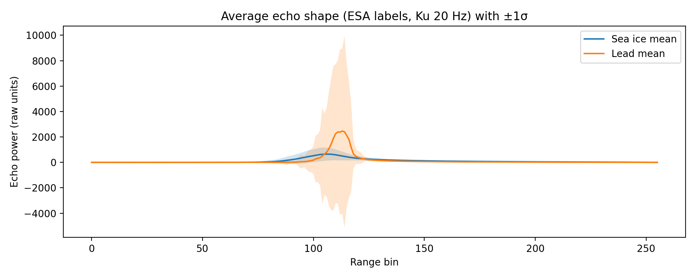
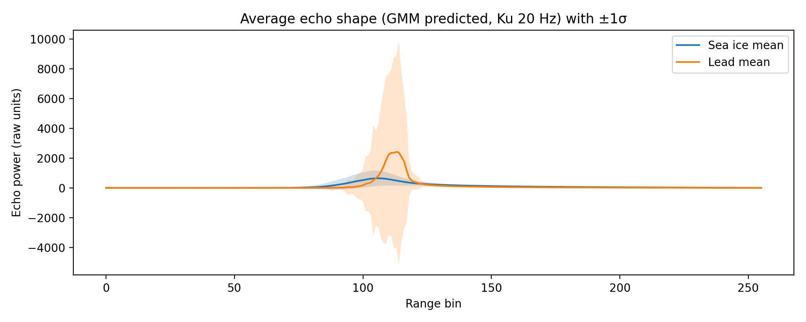

# GEOL0069 Week 4 — Echo Classification (Leads vs Sea Ice)

## Goal
Classify Sentinel-3 altimetry echoes into **lead** and **sea ice**, compute **average echo shape +/- 1σ** for each class, and **quantify classification** against the ESA official label using a **confusion matrix**.

## Results: Average echo shapes
### ESA-labelled (reference)

### KMeans predicted

### GMM predicted

## Results: Confusion matrices

### KMeans vs ESA (surf_type_class_20_ku)

### GMM vs ESA (surf_type_class_20_ku)

